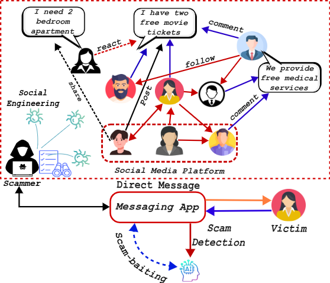
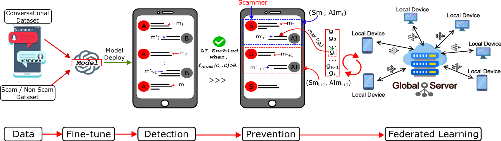

# 📘 AI-in-the-Loop

This repository contains **code, datasets, and experiments** for research on **AI-in-the-Loop safety evaluation and instruction tuning**.
It focuses on *scam-baiting conversations*, *federated instruction tuning with differential privacy*, and *benchmarking LLM responses for safety and robustness*.

🚨 **Threat Model:**



📡 🛡️ ⚙️ **Overview of the proposed real-time scam prevention system architecture:**



---

## 📂 Repository Structure

```
ai-in-the-loop/
├── data/                   
│   ├── classification/        # Data for classification tasks
│   ├── generation/            # Data for dataset generation
│   └── multi_task_train/      # Multi-task training datasets
│
├── logs/                      # Training and evaluation logs
│
├── source_code/               # Source code for experiments
│   ├── analyzer.ipynb                  # Jupyter notebook for analysis
│   ├── bilstm_bigru_fine_tuning.py     # BiLSTM-BiGRU model fine-tuning
│   ├── data.py                          # Dataset loading utilities
│   ├── dataset_convert.py               # Dataset preprocessing & conversion
│   ├── eval_scambait_turns.py           # Evaluation of scam-baiting turns
│   ├── evaluate_ai_response.py          # AI response evaluation pipeline
│   ├── evaluation_scam_baiting.py       # Scam-baiting dataset evaluation
│   ├── evaluation_scam_pii_engage.py    # PII engagement evaluation
│   ├── fed_dp_instruction_tuning.py     # Federated DP instruction tuning
│   ├── fed_evaluation_scam_baiting.py   # Federated scam-baiting evaluation
│   ├── fed_instruction_tuning.py        # Federated instruction tuning
│   ├── fed_scam_baiting_gen.py          # Federated scam-bait generation
│   ├── grid_search.ipynb                # Hyperparameter search experiments
│   ├── llm_instruction_tuning.py        # LLM instruction tuning
│   ├── prompt_util.py                   # Prompt construction utilities
│   ├── sammer_scam_baiter_conversation.py # Synthetic scam-baiting convos
│   ├── scam_bait_response_gen.py        # Scam-bait response generation
│   ├── transformer_model_tuning.py      # Transformer fine-tuning
│   └── utils.py                         # Helper functions
```

---

## 🚀 Getting Started

### 1️⃣ Clone the repository

```bash
git clone https://github.com/supreme-lab/ai-in-the-loop.git
cd ai-in-the-loop
```

### 2️⃣ Install dependencies

```bash
pip install -r requirements.txt
```

### 3️⃣ Run an example

```bash
python source_code/evaluate_ai_response.py
```

---

## 📊 Research Features

- **Scam-Baiting Datasets**

  - Legitimate scam-baiting conversations
  - Multi-task training resources for safety research
- **Federated + Differential Privacy**

  - Implementation of **federated instruction tuning**
  - Secure aggregation with Differential Privacy (DP) guarantees
- **Model Training**

  - LlamaGuard, LlamaGuard2, LlamaGuard3, and MD-Judge
  - BiLSTM-BiGRU and Transformer architectures (Bert-base, Bert-large, Distil-bert, RoBerta)
  - Hyperparameter search utilities
- **Evaluation Pipelines**

  - Multi-turn evaluation of scam-baiting responses
  - PII engagement & AI safety benchmarks

---

## 📜 Citation

If you use this repository in your research, please cite our work:

```bibtex
@inproceedings{hossain2025aiintheloop,
  title={AI-in-the-Loop: Benchmarking Scam-Baiting Conversations for Safety Evaluation},
  author={Hossain, Ismail, Puppala, Sai, Talukder, Sajedul.},
  booktitle={[Arxiv](https://arxiv.org/pdf/2509.05362)},
  year={2025}
}
```

---

## 📌 TODO

- [ ]  Add Hugging Face dataset links
- [ ]  Release pretrained checkpoints
- [ ]  Provide evaluation leaderboard

---

## 📜 License

This project is released under the **MIT License** (update if different).

---
